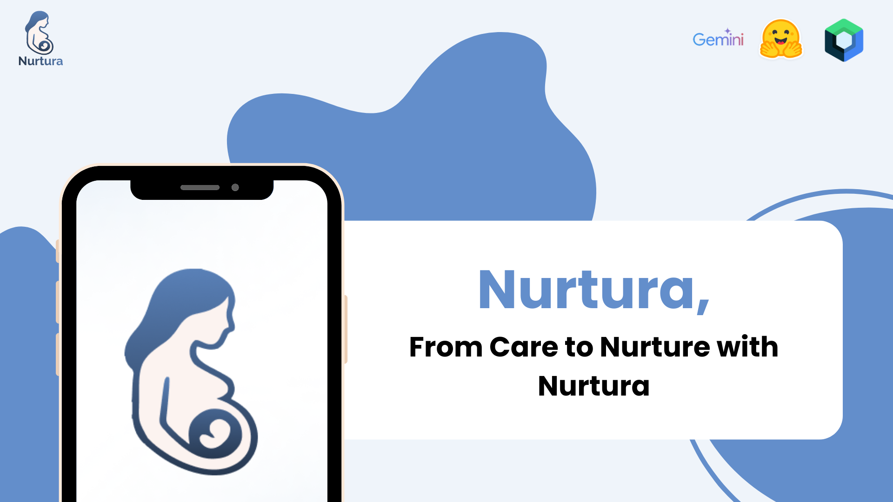
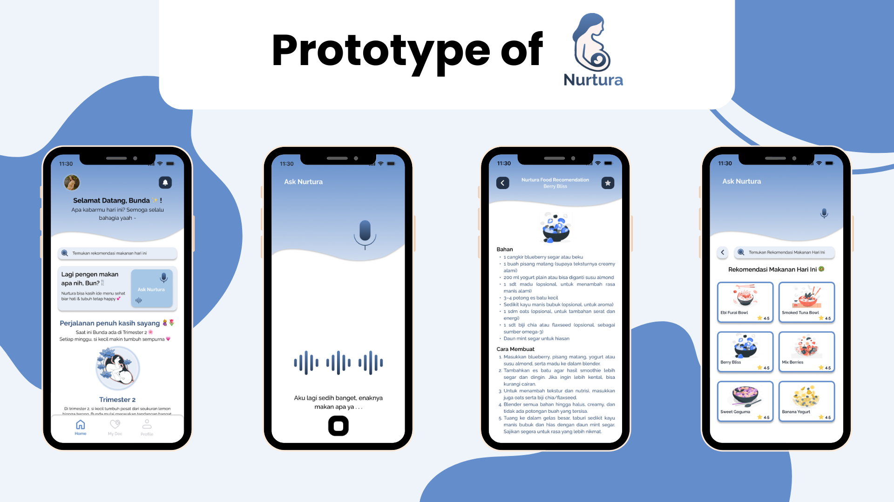
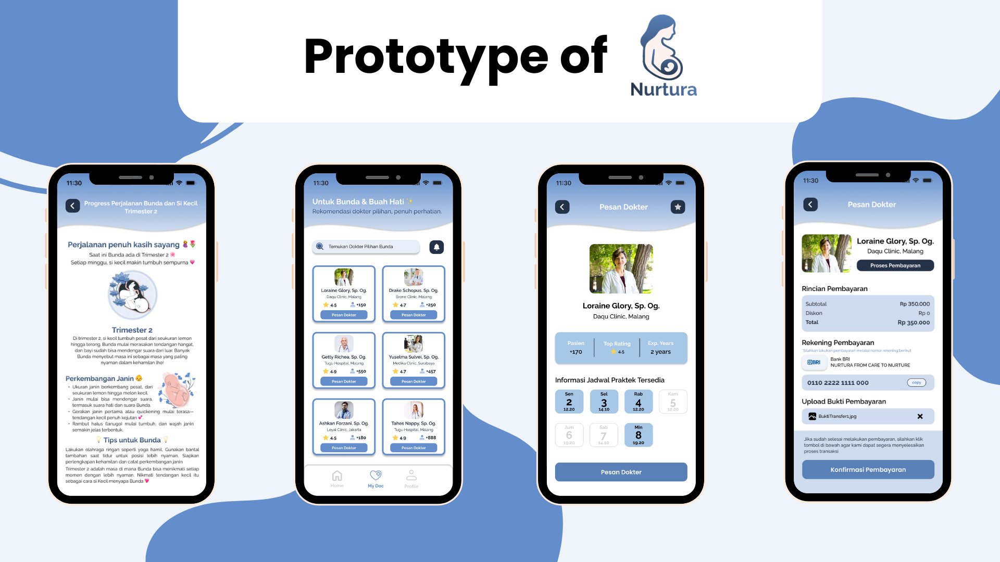

<h2 align="center">
  <b>Nurtura - Mobile App (Jetpack Compose) 🤰🏼</b> 
</h2>

As a team participating in **HackJam** (Hackathon & Game Jam) by Raion, we developed Nurtura, a mobile application designed to support **pregnant mothers in managing their well-being during pregnancy**. 
This project was built within 5 days, combining empathy, health insights, and AI technologies into a meaningful solution.

Mothers can record their voice to share feelings or ask for food suggestions, which are processed with Hugging Face Transformers via FastAPI. Based on the detected emotion, trimester stage, and health notes, 
Gemini AI provides personalized food recommendations. Nurtura also offers trimester-based pregnancy info and doctor consultations, with payment handled through manual transfer and proof securely stored in Cloudinary.

Built with **Jetpack Compose, Firebase, FastAPI, Hugging Face Transformers, Gemini AI, and Cloudinary**, this project highlights how mobile technology and AI can collaborate to provide practical, 
empathetic support for maternal health.

We believe that technology can nurture care, and Nurtura is our step toward empowering mothers during pregnancy with accessible and thoughtful solutions. 
The project is still evolving, and we’re excited to improve it further. 🌸🤰💙

## ✨ Features (MVP)

The following features were implemented as part of the app's initial MVP:

- 🔊  MyEmoTalk : Emotion-Based Food Recommendation
- 👶🏻  MyBaby : Pregnancy Info & Trivia
- 🧑🏻‍⚕️  MyDoc : Doctor Consultation Service

## 🛠️ Tech Stack

- Kotlin + Jetpack Compose (UI & Mobile Development)
- Firebase (Authentication, Database, Storage)
- FastAPI (Backend API for Emotion Detection)
- Hugging Face Transformers + PyTorch + Torchaudio (Speech Emotion Recognition)
- Gemini AI (Personalized Food Recommendation & Response Generation)
- Cloudinary (Media Storage for Payment Proof)

## 🧠 AI Model Repository

Speech Emotion Recognition Model
🔗 [View Repository](https://github.com/muktiabdii/voice-emotion-detection-api)
This model leverages Hugging Face Transformers with the Wav2Vec2-base-superb-er architecture to analyze voice recordings and classify the speaker’s emotional state.
The detected emotion is then used as contextual input for Gemini AI, which generates personalized food recommendations tailored to the mother’s condition.

## 📸 Prototype

  

  

## 👥 Group 8 Hackjam 

- [@Davis](https://www.linkedin.com/in/berliandavis/) — Product Manager
- [@Nada](https://www.linkedin.com/in/najadina/) — UI / UX 
- [@Abdi](https://www.linkedin.com/in/muktiabdii/) — Fullstack Developer
